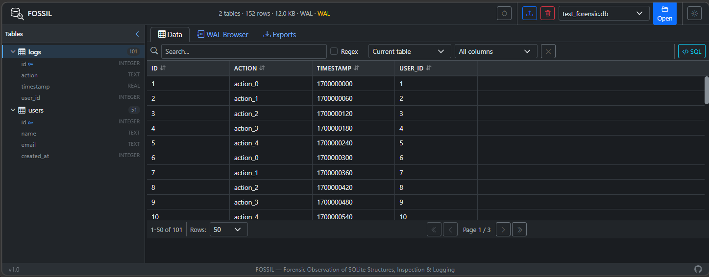

# FOSSIL

### **F**orensic **O**bservation of **S**QLite **S**tructures, **I**nspection & **L**ogging

A web-based SQLite database viewer built for investigators and analysts. Upload `.db`, `.sqlite`, or `.wal` files and inspect their contents through an interactive browser UI — no installs required beyond Docker.



---

## Features

- **Database Browser** — Upload and explore SQLite databases with a paginated, sortable data grid
- **SQL Query Editor** — Write and execute custom SQL with syntax highlighting, autocomplete, and saved query history
- **WAL Analysis** — Parse and inspect Write-Ahead Log files at the binary level (headers, frames, B-tree pages, cell records)
- **BLOB Inspection** — Detect 20+ file types via magic bytes, view hex dumps, render images, and export embedded files
- **Timestamp Decoding** — Auto-detect Unix, WebKit/Chrome, Windows FILETIME, Mac/Cocoa, and GPS epoch formats
- **Advanced Search** — Full-text and regex search across tables and columns
- **Data Export** — Export query results and table data as CSV or JSON
- **Row Inspector** — Field-by-field detail view with copy support (JSON, CSV, plaintext)
- **Dark Mode** — Full theme toggle with persistent preference
- **Offline-Ready** — All vendor assets (Bootstrap, icons) are bundled at build time

## Quick Start

```bash
docker compose up --build -d
```

Open [http://localhost:8080](http://localhost:8080) in your browser.

## Configuration

| Variable | Default | Description |
|----------|---------|-------------|
| Port | `8080` | Mapped in `docker-compose.yml` |
| Upload dir | `/app/upload` | Mounted as `./upload` volume |
| Exports dir | `/app/exports` | Mounted as `./exports` volume |
